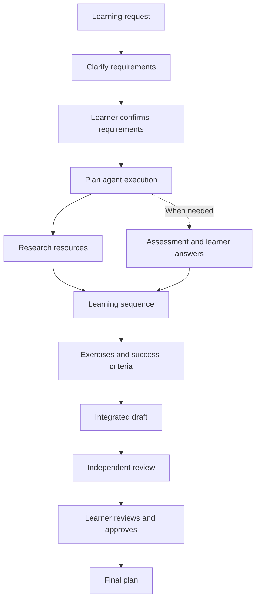

# Personalized learning assistant

This framework turns a learning request into a personalized plan with verified sources, a sequence of milestones, exercises, and success criteria. The learner confirms the requirements, answers diagnostic tasks when needed, and approves the completed plan.

**The result is a learning plan.** After producing it, the framework does not teach lessons, assess completed exercises, track learning progress, or adapt the curriculum based on learning outcomes. The exercises and criteria in the plan describe future work; their presence does not mean the learner has completed the tasks.

This README explains the framework and the learner's path. The main coordinator instructions are in [CLAUDE.md](CLAUDE.md), and the review rules are in [workflow/quality-gates.md](workflow/quality-gates.md).

## Quick start

You need Claude Code, Node.js 20 or newer, and Git for Windows.

An interactive Claude Code run needs authenticated model access. A subscription is one option; [Claude Console/API billing](https://code.claude.com/docs/en/authentication) is another paid option. Local workflow and hook tests below use Node.js and require neither a subscription nor API credentials.

Sign in to Claude Code, open a terminal at the project root, and run:

```powershell
claude
```

Accept the workspace trust prompt and the connection to the project's MCP server. You can check the configuration and server operation from another terminal in the same directory:

```powershell
claude mcp get learning_resources
node scripts/check-learning-resources-mcp.mjs
```

In the Claude Code chat, enter `/learn` followed by your goal. For example:

```text
/learn I want to learn to write useful C# unit tests for a small .NET service.
I have written some C#, but I am unsure how to choose test cases.
I can study 3 hours per week for 6 weeks on Windows.
I need free English resources.
Outcome: a small service with tests I can run locally.
```

The coordinator will clarify missing details and show the requirements for confirmation. You do not need every answer in advance: uncertainty about your starting level can be resolved through a short assessment.

## How one run works

A run prepares one learning plan. Its documents and state are saved in a separate `runs/<run-id>/` directory.



Each transition to a dependent stage requires its input documents to pass review. Assessment is included in the dependencies only when the coordinator selects it.

| Step | What happens | Owner |
| --- | --- | --- |
| 1. Request | The learner's original wording is preserved, and the run directory and workflow state are created. | Coordinator |
| 2. Requirements | The goal, current knowledge, time, constraints, and observable outcome are clarified. The learner explicitly confirms a specific revision; research does not begin before confirmation. | `requirements-formalizer` and learner |
| 3. Execution plan | Participants, dependencies, and the need for assessment are determined. The reason for the selection is recorded. | Coordinator |
| 4. Resources | Materials are selected, actual pages are opened, and their suitability and accessibility are checked. | `resource-researcher` |
| 5. Assessment, when needed | The learner completes short tasks. Their answers are preserved and evaluated to determine the starting point. | `starting-level-diagnostician` and learner |
| 6. Sequence | Achievable learning milestones are defined with prerequisites, resources, and time allocations. | `learning-path-planner` |
| 7. Practice | Each milestone receives an exercise, expected evidence, a success criterion, and a recovery step for difficulties. | `practice-assessor` |
| 8. Draft | Requirements, resources, sequence, and practice are combined into one readable plan. | `learning-plan-synthesizer` |
| 9. Independent review | The exact draft revision and its input documents are reviewed. Findings are returned for repair. | `learning-plan-validator` |
| 10. Approval and final output | The learner reviews the validated draft. After explicit approval, the CLI produces the final file. | Learner and coordinator |

Resource research and the selected assessment can run in parallel: both use the confirmed requirements and neither depends on the other. The sequence waits for them to finish; practice waits for the sequence, and draft synthesis waits for practice.

The coordinator manages the conversation, dispatches agents, and records decisions. Five core agents create their own documents, the assessment agent is selected when needed, and the independent validator reviews the draft without editing it.

## How results are validated

At each handoff, the `artifact-validator` skill checks structure, exact input documents, content, and limitations. The coordinator registers the file and records the result of each required gate with a concrete finding.

Agents assess content. The `scripts/learning-workflow.mjs` script enforces stage order, revisions, hashes, retry limits, and approval. It does not independently determine the quality of a learning plan.

The coordinator's working cycle is:

```text
start → agent creates document → artifact-validator → inspect → gate
```

For the integrated draft, `artifact-validator` checks structure before registration. After `inspect`, the independent `learning-plan-validator` separately reviews all six gates:

- Readable structure and exact input revisions.
- Alignment with the confirmed goal and starting level.
- Credible and relevant source citations.
- Achievable milestone order and prerequisites.
- Feasible weekly and total time allocations.
- Alignment of exercises with milestones, observable results, and useful recovery steps.

A claimed fault detector requires a concrete example: an input, the correct result, the faulty result, and a check that distinguishes them. If both implementations produce the same result, the exercise does not count as a way to detect that fault.

The researcher uses web search and the `learning_resources` MCP for supported pages. The MCP tool fetches public HTTPS pages on `docs.python.org`, `learn.microsoft.com`, and `www.py4e.com`. Other sources can be researched through web search and by opening the actual pages. A failed fetch is not source verification; the date of a previous check is distinguished from current availability.

## Where learner input is required

The first required decision is confirmation of a specific requirements revision. If assessment is selected, actual answers to its tasks are also required. The learner then receives the draft only after all six final gates pass.

To approve the draft, respond with a standalone sentence naming its current revision. For example, for v02:

```text
I approve validated draft v02.
```

If the plan does not fit, describe what needs to change instead of approving it. Requirements confirmation does not replace approval of the completed plan. The coordinator preserves actual responses; automated test data does not count as learner confirmation.

Before producing the final file, the CLI checks approval, the draft revision, input files, and all required gates. The final document receives an approved title, artifact type, and status; known legacy review wording is normalized without changing the learning content or claiming exercise completion. Successful completion is reported as `approval: approved` and `final: passed`.

## What happens after a failure or rejection

A finding is returned to the owner of the smallest defective document. For example, if an exercise is defective, practice is repaired and the integrated draft is regenerated; suitable resources and the sequence are reused.

An already passing stage can be reopened with a required repair reason:

```powershell
node scripts/learning-workflow.mjs start runs/<run-id> practice "Week 3 recovery does not distinguish the claimed fault"
```

Replace `<run-id>` with the run directory name. Missing, failed, or stale stages use the usual `start` command without a required reason.

Restarting preserves history, requires a new numbered revision, and makes dependent documents and previous approval stale. The changed document and affected downstream stages are reviewed again. If input files change while an agent is working, that stage must be restarted with current inputs.

Each stage permits at most three inspections (`inspect`). Reopening does not reset the count. If the problem remains after the third inspection, dependent work stops and the coordinator reports the reason and affected documents.

## Files in runs

`vNN` in a filename denotes a document revision. The revision number is not the inspection count: a proposed file may never reach `inspect`.

| File in the run directory | Purpose |
| --- | --- |
| `requirements-brief-vNN.md` | Learner requirements and evidence of their confirmation. |
| `execution-plan-vNN.md` | Agent execution plan, assessment selection, participants, and dependencies. |
| `learning-resources-vNN.md` | Selected resources, page checks, and source limitations. |
| `starting-level-diagnosis-vNN.md` | Assessment prompts, actual answers, evaluation, and starting point; only when assessment is selected. |
| `learning-sequence-vNN.md` | What to study, in which order, and how much time to allocate. |
| `learning-practice-vNN.md` | What to do at each milestone and how to check the result. |
| `learning-draft-vNN.md` | The complete plan for independent validation and learner review. |
| `learning-plan-final.md` | An approved copy of the accepted draft with a final title and status. |
| `workflow-state.json` | Current revisions, hashes, dependencies, gate findings, counters, events, and approval. |

Current files are identified through `workflow-state.json`, rather than simply by the highest version number. Previous revisions preserve questions, confirmations, and repairs; current documents may reference them. The validator does not create another plan revision: its decisions are recorded in workflow state.

For using the completed plan, `learning-plan-final.md` is usually sufficient. The other files support preparation, validation, and resumption. Before cleaning a directory, check references and dependencies: deleting an old revision may lose original answers or the document the learner confirmed. Archive verified unused duplicates outside the submission, preserving their original paths and hashes.

## Resuming after an interruption

From a terminal at the project root, check the run:

```powershell
node scripts/learning-workflow.mjs status runs/<run-id>
Get-Content runs/<run-id>/workflow-state.json
```

Then resume the Claude Code session with `claude -c`, or open a new session and ask to continue the run by name. The coordinator reads the state and execution plan, reuses only current validated documents, and continues the remaining work.

The main stage statuses are: `missing` — no result yet; `in-progress` — the stage has started; `pending` — a document has been registered and awaits gate decisions; `passed` — the required gates pass; `failed` — there are failed gates; `stale` — the document or its inputs have changed; `exhausted` — three inspections have been used and the required gates have not all passed. `omitted` applies to skipped assessment. Approval and final-file statuses are reported separately.

A hash detects changes to a validated file. Changed inputs require dependent results to be updated, and previous approval no longer permits final output. `status` detects external edits. The project's Claude Code hooks check authorization before final-file writes and update state after Write/Edit operations; they launch the workflow from the active checkout, including a worktree. The final file is produced through the CLI after approval.

## Examples and project checks

Three QA runs are stored in the repository. Their state as of October 1, 2026:

| Run | Outcome |
| --- | --- |
| [C# unit testing](runs/csharp-unit-testing-2026-09-30/) | The final plan is approved; the repaired exercise passed independent review. |
| [Python CSV cleaning](runs/python-csv-cleaning-2026-09-30/) | The final plan is approved. |
| [Python file automation](runs/python-file-automation-2026-09-30/) | The draft passed validation but was rejected by the learner: copying is required instead of moving. No final file has been produced. |

These outcomes describe plan preparation, rather than learning completion. Use `status` to check an example's current state.

Run the workflow regression checks with:

```powershell
node --test scripts/learning-workflow.test.mjs
```

The tests exercise the real CLI and the commands configured in `.claude/settings.json` in isolated copies with explicitly synthetic data and approvals. They cover reopening stages, invalidating previous approval, changing inputs, retry limits, deterministic final export, and both hooks. Hook checks include denial before approval, permission after approval, persistence after Write/Edit, and denial after inputs change. Temporary paths contain spaces; learner runs are not modified.

Check the MCP protocol and URL guard separately:

```powershell
node scripts/check-learning-resources-mcp.mjs
```

These checks run without Claude Code authentication and do not call a language model. They exercise hook commands directly with synthetic event payloads; they do not prove that Claude Code dispatched those hooks in an interactive session. The MCP smoke test checks the protocol and URL guard, rather than live source availability or Claude's connection approval. The stored runs demonstrate learning artifacts and decisions; they do not establish execution inside Claude Code.

Interactive agent dispatch, hook invocation, MCP connection/use, and session resumption in Claude Code remain unverified. An authenticated acceptance run is required to confirm them.

New `runs/` directories are included in the normal Git workflow. Before committing, check documents for personal data and secrets. Keep credentials outside the repository.
